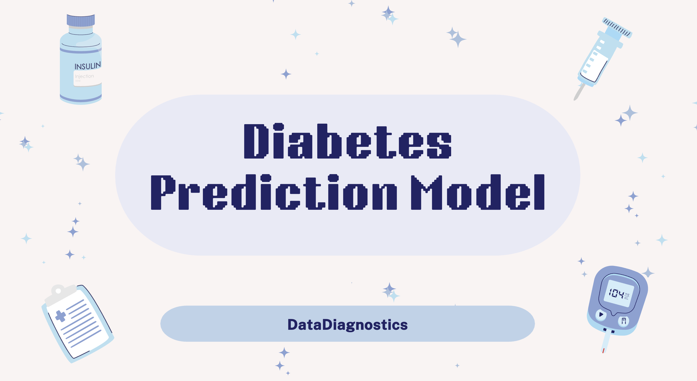

# Project Title: Development of a Diabetes Prediction Model using Machine Learning

## Contents
1. [Project Overview](#1-project-overview)
2. [Requirements](#2-requirements)
3. [Getting Started](#3-getting-started)
4. [Documentation](#4-documentation)
5. [Notebook Contents](#5-notebook-contents)
6. [Ethical Considerations](#6-ethical-considerations)
7. [Conclusion](#7-conclusion)
8. [References](#8-references)
9. [Acknowledgments](#9-acknowledgments)
10. [Collaborators](#10-collaborators)


## 1. Project Overview

Diabetes is a prevalent chronic disease that affects millions of people worldwide. Early detection and prediction of diabetes are crucial for effective management and prevention of complications. This project aims to develop a predictive model to identify individuals at risk of developing diabetes based on various health indicators.

By leveraging machine learning algorithms and techniques, we will analyse anonymous health records encompassing parameters such as BMI, age, blood pressure, dietary habits, etc. The project will employ feature selection methods and experiment with various algorithms, including  Logistic Regression, Random Forest, Decision Tree, Support Vector Machines (SVM), K-Nearest Neighbors (KNN) and Neural Network, to build a robust and accurate predictive tool.

The ultimate goal of this project is to gain insights into the significant factors contributing to the prediction of diabetes occurrence. Through early detection and intervention, the project aims to contribute to better management and prevention of diabetes, thus improving public health outcomes.

The main component of this project is a Jupyter Notebook (`diabetes_prediction.ipynb`), which is intended to be run in Google Colaboratory (Google Colab). The notebook demonstrates the process of predicting diabetes using various machine learning models, covering data preprocessing, exploratory data analysis, model training, evaluation, and comparison.


## 2. Requirements

- A web browser capable of running Google Colab
- A Kaggle account (for data fetching)
- A Google account (for storage of data)


## 3. Getting Started

**Kaggle**
1. Sign in to [Kaggle](https://kaggle.com) `https://kaggle.com/`.

2. Go to Settings.

3. Under the API section, create and download token `kaggle.json`.

**GitHub Repository**
1. Clone the repository:

   ```git clone https://github.com/bernardtse/diabetes_prediction.git```

2. Navigate to the project directory:

   ```cd diabetes_prediction```

**Running the notebook in Google Colab**

1. Sign in to [Google Colab](https://colab.research.google.com/) `https://colab.research.google.com/`.

2. Upload the notebook file `diabetes_prediction.ipynb` to Google Colab.

3. Upload `kaggle.json` to the path specified in the Jupyter notebook in Google Drive (Default path: `My Drive`). If `kaggle.json` was already installed previously, modify the `kaggle_token_path` variable in the notebook to specify the path for Kaggle token.

4. Ensure that you have the necessary libraries installed. The notebook requires the following libraries:

   - `pandas`
   - `numpy`
   - `matplotlib`
   - `seaborn`
   - `scikit-learn`
   - `tensorflow`
   - `keras-tuner`

   You can install these libraries in Google Colab by running the following code cell at the beginning of the notebook:

   ```!pip install pandas numpy matplotlib seaborn scikit-learn tensorflow keras-tuner```

5. Run the notebook cells sequentially to execute the code and interact with the project.

**Note**
The notebook is designed to run on the cloud environment provided by Google Colab. It utilises the `Kaggle API` for data fetching and `Spark` for data processing. Both are automatically set up within the Colab environment. Therefore, there is no need to install Spark and the Kaggle API locally.


## 4. Documentation

- **README**: Project overview and the instructions of running the Jupyter notebook is available in [`README.md`](README.md).
- **Project Report**: The project design, data processing procedures, model building and evaluation, tuning and optimisation are included in [`report.md`](report.md). The results of each model is presented and compared.

- Graphs generated by the Jupyter notebook are stored in the [`images/`](images/) folder.
- Raw dataset is stored in [`resources/diabetes_dataset__2019.csv`](resources/diabetes_dataset__2019.csv)
- Processed dataset is stored in [`resources/processed_dataset.csv`](resources/processed_dataset.csv).
- Model architecture for Neural Network is stored in [`resources/model.json`](resources/model.json).
- Model weights for Neural Network is stored in [`resources/model_weights.h5`](resources/model_weights.h5).


## 5. Notebook Contents

1. **Introduction:**
   - Overview of the problem and dataset.
   
2. **Data Preprocessing:**
   - Handling missing values
   - Converting categorical variables to numerical format
   - Feature scaling

3. **Exploratory Data Analysis:**
   - Visualising distributions of numerical variables
   - Correlation analysis
   
4. **Model Building:**
   - Logistic Regression
   - Random 
   - Decision Tree
   - Support Vector Machine (SVM)
   - K-Nearest Neighbors (KNN)
   - Neural Network
   
5. **Model Evaluation:**
   - Confusion matrix
   - Receiver Operating Characteristic (ROC) curve and Area Under the Curve (AUC)
   - Precision-recall curve
   
6. **Hyperparameter Tuning:**
   - Hyperparameter Tuning with GridSearchCV
   
7. **Neural Network Optimisation:**
   - Hyperparameter optimisation with Keras Tuner

8. **Results and Summary Report:**
   - Evaluation summary of each model
   - Comparisons of different models


## 6. Ethical Considerations

In the development of a machine learning model for diabetes prediction using a Kaggle dataset, ethical considerations play a central role. It is essential to prioritise data privacy, maintain transparency in model development, and ensure equitable access to healthcare insights. Additionally, efforts to mitigate bias in data collection and algorithmic decision-making are vital for responsible and ethical deployment in healthcare contexts.


## 7. Conclusion

Through this project, we demonstrated the application of machine learning techniques for diabetes prediction. By evaluating multiple models and optimising their performance, we aim to provide valuable insights for healthcare professionals in diagnosing and managing diabetes effectively.

**Disclaimer:** This project serves as an educational resource and does not replace professional medical advice. Always consult a healthcare provider for diagnosis and treatment of medical conditions.


## 8. References

- **Dataset:** https://www.kaggle.com/datasets/tigganeha4/diabetes-dataset-2019
- **Research Paper for the Dataset:** Tigga, N. P., & Garg, S. (2020). Prediction of Type 2 Diabetes using Machine Learning Classification Methods. Procedia Computer Science, 167, 706-716. DOI: https://doi.org/10.1016/j.procs.2020.03.336
- **Diabetes Facts & Figures - International Diabetes Federation:** https://idf.org/about-diabetes/diabetes-facts-figures/


## 9. Acknowledgments

We would like to thank all contributors and participants who have made this project possible.


## 10. Collaborators

- [Aysha Gheewala](https://github.com/AyshaGheewala)
- [Godswill Anyasor](https://github.com/AnyasorG)
- [Kehlani Khan](https://github.com/kehlanijaan)
- [Sum Yeung Bernard Tse](https://github.com/bernardtse)
